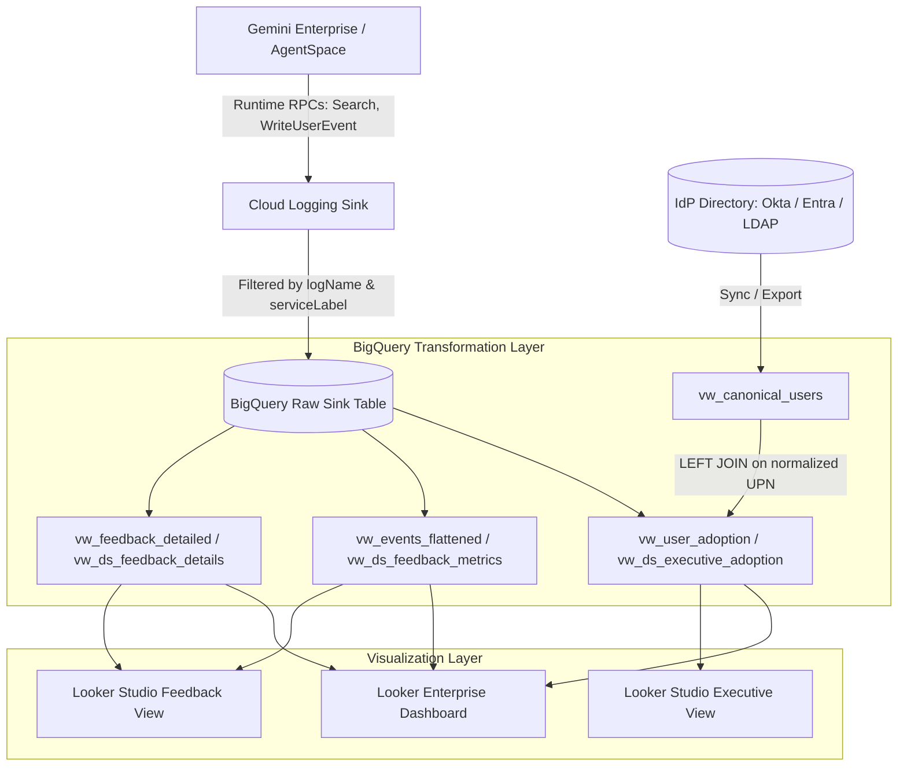

# Google Cloud Gemini Enterprise Telemetry & Adoption Pipeline

[](https://cloud.google.com/logging)
[](https://cloud.google.com/bigquery)
[](https://cloud.google.com/looker)
[](https://lookerstudio.google.com/)

An end-to-end monitoring, telemetry, and adoption analytics pipeline for **Google Cloud Gemini Enterprise** (Discovery Engine / AgentSpace). 

This solution captures live user interactions from Cloud Logging, normalizes multi-turn conversations and feedback in BigQuery, correlates activity against enterprise identity directories (Okta, Microsoft Entra ID, LDAP), and powers executive adoption dashboards in both **Looker Enterprise** and **Looker Studio (Google Data Studio)**.

---

## Architecture Overview



---

## Key Problem Solved: The "Never Logged In" Adoption Gap

Standard Gemini Enterprise analytics report aggregate license counts, but fail to answer the primary operational question: **"Which specific users have been granted access but have never logged in?"**

1. **Log Analysis Alone is Insufficient**: Querying log tables only reports *active* users. It cannot report on users who are missing from the logs entirely.
2. **Directory Grounding**: By left-joining an authoritative identity directory (Okta, Microsoft Entra ID, or LDAP) against telemetry logs, this pipeline computes exact adoption percentages and flags non-adopters (`needs_follow_up = TRUE`) for targeted organizational enablement.
3. **Contextual Root-Cause Feedback**: When users submit thumbs-down feedback, the pipeline reconstructs the preceding 10 minutes of queries so developers can see what prompt triggered the issue.

---

## Repository Structure

```
gps_ce_geminienterprisedashboard/
├── README.md                                  # Complete implementation guide & rationale
├── .gitignore
├── diagrams/
│   └── code_flow.dot                          # Graphviz DOT architecture diagram
├── sql/
│   ├── 01_synthetic_directory.sql            # Seeder: 5,800 users across 12 regions & 12 business units
│   ├── 02_views_looker_enterprise.sql        # Core BigQuery views for Looker Enterprise LookML
│   └── 03_views_looker_studio.sql            # Pre-flattened views tailored for Looker Studio
└── looker/
    ├── models/
    │   └── agentspace_monitoring.model.lkml   # LookML explore & join relationships
    ├── views/
    │   ├── user_adoption.view.lkml            # Directory mapping & adoption metrics
    │   ├── events_flattened.view.lkml         # Search and prompt volume tracking
    │   └── feedback_detailed.view.lkml        # Unnested feedback reasons & sentiment
    └── dashboards/
        └── aes_knowledge_assistant.dashboard.lookml # Declarative dashboard definition
```

---

## Step-by-Step Implementation Guide & Design Rationale

### Step 1: Cloud Logging Ingestion & Filter Design
In Google Cloud Console, navigate to **Logging** $\rightarrow$ **Log Router** and create a sink targeting your BigQuery dataset:

```text
logName =~ "discoveryengine\.googleapis\.com%2Fgemini_enterprise_user_activity$"
AND jsonPayload.logMetadata.serviceLabel = "GEMINI_ENTERPRISE"
AND jsonPayload.logMetadata:*
```

* **Why `=~ "...$"` (Regex)**: Omitting hardcoded project prefixes ensures the sink filter works seamlessly across development, staging, and production environments.
* **Why `logName` + `serviceLabel`**: `logName` is an indexed partition key in Cloud Logging. Evaluating `logName` first allows the router to instantly discard millions of non-Gemini project logs (VPC, GKE, Compute) without scanning unindexed JSON payloads.

---

### Step 2: Canonical Identity Adapter (`vw_canonical_users`)
Instead of coupling downstream views directly to a vendor-specific IdP table, create an abstraction view (`sql/02_views_looker_enterprise.sql`):

```sql
CREATE OR REPLACE VIEW `YOUR_PROJECT.YOUR_DATASET.vw_canonical_users` AS
SELECT
  LOWER(TRIM(userPrincipalName)) AS user_principal_name,
  displayName AS display_name,
  COALESCE(region, 'Unknown') AS region,
  COALESCE(businessUnit, 'Unassigned') AS business_unit,
  COALESCE(supervisorName, 'Unassigned') AS supervisor_name,
  COALESCE(accountStatus, 'ACTIVE') AS account_status,
  created_at AS license_assigned_at
FROM
  `YOUR_PROJECT.YOUR_DATASET.okta_user_principals`
WHERE
  COALESCE(accountStatus, 'ACTIVE') = 'ACTIVE';
```

* **Why `LOWER(TRIM(...))`**: BigQuery string joins are binary case-sensitive. GCP IAM logs output lowercase principals, whereas Okta/Entra often preserve mixed casing. Normalizing casing prevents active users from falsely appearing as "Never Logged In".
* **Why Filter `accountStatus = 'ACTIVE'`**: Prevents deprovisioned former employees from contaminating enablement follow-up lists.

---

### Step 3: Resolving the Adoption Gap (`vw_user_adoption`)
Performs a `LEFT OUTER JOIN` from the canonical directory to the raw log sink:

* **Why Left Join on Directory**: Keeps the directory as the base table. Users with zero log records cleanly evaluate to `NULL`, automatically classifying them as `Inactive (Never Logged In)`.
* **Why Exclude Service Accounts**: Filters out `useriamprincipal NOT LIKE '%gserviceaccount.com'` so backend evaluators do not artificially inflate user metrics.

---

### Step 4: Multi-Turn Feedback Context (`vw_feedback_detailed`)
Reconstructs the user journey leading up to a thumbs-down feedback event:

* **Why `CROSS JOIN UNNEST(reasons)`**: End-users can select multiple dissatisfaction reasons simultaneously. Unnesting enables independent category counting in charts.
* **Why 10-Minute Context Window**: Uses an `ARRAY_AGG` joined on timestamp to surface the user's immediate preceding prompts and answers.

---

### Step 5: Looker Studio Dedicated Views (`sql/03_views_looker_studio.sql`)
Looker Studio / Data Studio does not support LookML or nested `ARRAY<STRUCT>` types in standard tables. Three dedicated views provide pre-flattened data:
1. `vw_ds_executive_adoption`: Bakes in `'Logged In At Least Once'` vs `'Never Logged In'` strings for stacked bars, and binary `is_active` flags for scorecards.
2. `vw_ds_feedback_metrics`: Unnests feedback reasons for pie and donut charts.
3. `vw_ds_feedback_details`: Converts the 10-minute prompt history into a newline-delimited string (`STRING_AGG(..., '\n')`) for rendering inside table cells.

---

## Deploying the BI Dashboards

### Option A: Looker Enterprise Deployment
1. Copy the files in `looker/views/` into your Looker project's view directory.
2. Copy `looker/models/agentspace_monitoring.model.lkml` into your Looker model directory. Update `connection:` to your Looker BigQuery connection name.
3. Create a Dashboard file ending in `.dashboard.lookml` and paste the contents of `looker/dashboards/aes_knowledge_assistant.dashboard.lookml`.
4. Access your dashboard at:
   ```text
   https://<instance_id>.looker.app/dashboards/agentspace_monitoring::aes_knowledge_assistant
   ```

---

### Option B: Looker Studio (Google Data Studio) Deployment
1. Open **[Looker Studio](https://lookerstudio.google.com/)** and create a new Report.
2. Connect to BigQuery $\rightarrow$ Select your Project and Dataset.
3. Add the three Data Studio views:
   * `vw_ds_executive_adoption`
   * `vw_ds_feedback_metrics`
   * `vw_ds_feedback_details`
4. **Page 1 (Executive View)**:
   * Top KPIs: Scorecards using `is_active`, `is_never_logged_in`, and `% Adoption`.
   * Left Chart: Horizontal Stacked Bar $\rightarrow$ Dimension: `region`, Breakdown: `login_status`.
   * Center Chart: Horizontal Stacked Bar $\rightarrow$ Dimension: `business_unit`, Breakdown: `login_status`.
   * Right Grid: Pivot Table $\rightarrow$ Rows: `region`, `business_unit`, `supervisor_name`; Column: `login_status`.
5. **Page 2 (Feedback Metrics)**:
   * Top Right Pie: Dimension: `feedback_reason`, Filter: `feedback_type = 'DISLIKE'`.
   * Bottom Master Grid: Table from `vw_ds_feedback_details` using `user_query_context` with text-wrapping enabled.

---

## Security & Privacy Guidelines
* All synthetic identifiers use RFC 2606 reserved domains (`example.gov`).
* Production deployments should enforce BigQuery column-level security or row-level access policies (RLS) if individual departments should only view their respective regional adoption metrics.
